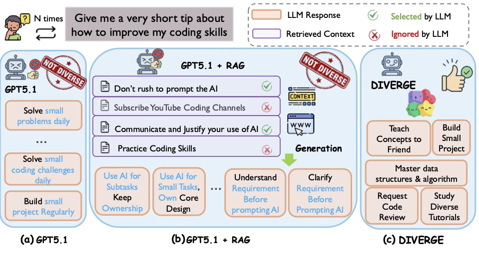
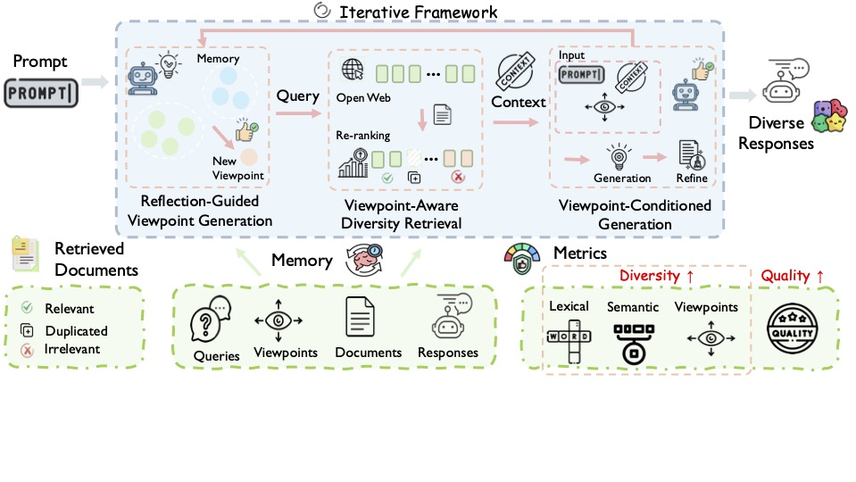

# Diverge

## 🎯 Overview

Existing RAG systems are largely built around a *single-answer assumption* and are primarily optimized for correctness.
However, many real-world information-seeking queries are **open-ended** and admit multiple plausible answers.
In such settings, standard RAG often collapses to homogeneous outputs—even when retrieved contexts contain diverse evidence, as illustrated below.

<p align="center">
  
</p>

DIVERGE is a plug-and-play, agentic Retrieval-Augmented Generation (RAG) framework
designed to **enhance output diversity for open-ended information-seeking queries** while maintaining high answer quality.
Unlike standard RAG systems that are optimized for a single correct answer, DIVERGE explicitly models and explores **multiple viewpoints** through iterative retrieval and generation, while maintaining high answer quality. The overall architecture is shown below.

<p align="center">
  
</p>

This repository contains the reference implementation and evaluation code for the paper  
**“DIVERGE: Diversity-Enhanced Retrieval-Augmented Generation for Open-Ended Questions.”**  

📄 Paper: https://arxiv.org/pdf/2602.00238
🗂️ Dataset: https://huggingface.co/datasets/au-clan/Diverge

## 🧠 Key Ideas

DIVERGE improves diversity through three core mechanisms:

1. **Reflection-Guided Viewpoint Generation**  
   The model reflects on previously generated answers to extract salient viewpoints
   and explicitly proposes new, insufficiently covered viewpoints to guide future
   retrieval and generation.

2. **Diversity-Aware Retrieval**  
   Retrieved documents are reranked by jointly considering:
   - relevance to the current query
   - diversity with respect to previously retrieved contexts (memory)
   - diversity among candidates selected in the current iteration

3. **Viewpoint-Conditioned Generation with Memory**  
   Generation is conditioned on both the original query and a target viewpoint,
   while a lightweight memory prevents repetition and supports long-horizon diversity.

Importantly, DIVERGE operates **entirely at the retrieval and prompting level** and
**does not rely on token-level logits or decoding hyperparameters**, making it
compatible with **any frontier or closed-source LLM**.

## 🛠️ Installation

We provide a installation process to set up a virtual environment and install the necessary dependencies for our experiments. Follow the steps below to get started.

---

### 1. Create a Virtual Environment

#### macOS / Linux

```bash
python -m venv .venv
source .venv/bin/activate
```

#### Windows

```bash
python -m venv .venv
.venv\Scripts\activate
```

---

### 2. Install the Local Package

Install the project in editable mode:

```bash
pip install -e .
```

This step installs the local `divrag` package defined in `pyproject.toml`.

---

### 3. Install Experiment Dependencies

```bash
pip install -r requirements.txt
```

This step installs the exact dependency versions used in our experiments.

---

### Important Notes

- Both installation steps are required.
- `pyproject.toml` makes the local package (`divrag`) importable.
- `requirements.txt` ensures full reproducibility of the experimental environment.

## How to Start?

---

---

## Citation

If you use this dataset, please cite:

```bibtex
@article{hu2026diverge,
  title={DIVERGE: Diversity-Enhanced RAG for Open-Ended Information Seeking},
  author={Hu, Tianyi and Tandon, Niket and Arora, Akhil},
  journal={arXiv preprint arXiv:2602.00238},
  year={2026}
}
```